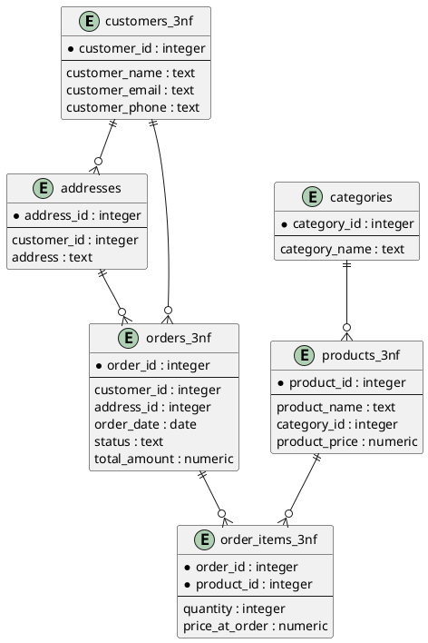

# ИДЗ-1. PostgreSQL: структуры данных, нормализация и денормализация

## Информация о студенте

**Выполнил:** Желанов Даниил  
**Группа:** P4150  
**Дисциплина:** Взаимодействие с базами данных  
**СУБД:** PostgreSQL 17.4  

## Цель работы

Спроектировать реляционную базу данных в PostgreSQL, пройти путь от ненормализованной «плоской» таблицы до 3NF, затем осознанно денормализовать под конкретный сценарий чтения. Понять, когда нормализация помогает, а когда мешает.

## Структура

```text
idz1/
├── README.md
├── schema.puml
├── sql/
│   ├── 00_orders_raw.sql
│   ├── 01_to_1nf.sql
│   ├── 02_to_2nf.sql
│   ├── 03_to_3nf.sql
│   ├── 04_oltp_queries.sql
│   ├── 05_indexes.sql
│   ├── 06_denorm_mv.sql
│   └── 07_denorm_table.sql
├── scripts/
│   └── generate_data.py
└── checks/
    ├── anomalies.txt
    ├── explain_before_idx.txt
    ├── explain_after_idx.txt
    ├── mv_vs_join.txt
    └── trgm_demo.txt
```

## Часть 1. Ненормализованная таблица

Создана таблица `orders_raw`, которая имитирует выгрузку из Excel.

В таблице данные о заказе, клиенте, адресе доставки и товарах хранятся вместе.
Поля `product_names`, `product_prices` и `product_quantities` содержат списки значений через запятую, поэтому таблица не находится в 1NF.

Тестовые данные генерируются скриптом `scripts/generate_data.py`.
Скрипт создаёт 1200 строк.

### Аномалии

**Аномалия вставки.**  
Нельзя добавить товар отдельно от заказа. Например, товар Игровое кресло с ценой 18990 пришлось бы добавлять через создание фиктивного заказа.

**Аномалия обновления.**  
Данные клиента повторяются в нескольких строках. Если у клиента изменится телефон или email, нужно обновлять все его заказы. Если обновить только часть строк, появятся разные данные об одном и том же клиенте.

**Аномалия удаления.**  
Информация о товарах хранится только внутри заказов. Если удалить все заказы, где встречается товар, например USB-хаб, то информация об этом товаре исчезнет из базы.

## Часть 2. Нормализация до 3NF

### 1NF

На первом шаге составные поля `product_names`, `product_prices` и `product_quantities` были разбиты на отдельные строки.

Созданы таблицы:

- `orders_1nf` — данные заказа;
- `order_items_1nf` — товары внутри заказа.

Проверка количества строк:

```sql
SELECT 'orders_1nf' AS table_name, COUNT(*) AS rows_count FROM orders_1nf
UNION ALL
SELECT 'order_items_1nf' AS table_name, COUNT(*) AS rows_count FROM order_items_1nf;
```

Результат:

|table_name    | rows_count |       
|-----------------|-----------|
|orders_1nf      |       1200|
|order_items_1nf |       3098|

Пример данных из `orders_1nf`:

```sql
SELECT order_id, order_date, customer_name, customer_email, customer_phone,
       delivery_address, total_amount, status
FROM orders_1nf
ORDER BY order_id
LIMIT 5;
```

| order_id | order_date | customer_name | customer_email | customer_phone | delivery_address | total_amount | status |
|---:|---|---|---|---|---|---:|---|
| 1 | 2024-08-28 | Иванов Иван Иванович | ivanov@example.com | +79990000001 | Санкт-Петербург, Литейный проспект, д. 25 | 52000 | delivered |
| 2 | 2024-08-05 | Сидорова Анна Сергеевна | sidorova@example.com | +79990000003 | Санкт-Петербург, Литейный проспект, д. 25 | 4500 | delivered |
| 3 | 2024-03-22 | Сидорова Анна Сергеевна | sidorova@example.com | +79990000003 | Новосибирск, Красный проспект, д. 31 | 8000 | processing |
| 4 | 2024-07-25 | Иванов Иван Иванович | ivanov@example.com | +79990000001 | Москва, ул. Тверская, д. 7 | 6900 | processing |
| 5 | 2024-12-21 | Федорова Ольга Николаевна | fedorova@example.com | +79990000009 | Санкт-Петербург, Московский проспект, д. 120 | 2400 | new |

Пример данных из `order_items_1nf`:

```sql
SELECT order_id, item_position, product_name, product_price, product_quantity
FROM order_items_1nf
ORDER BY order_id, item_position
LIMIT 10;
```

| order_id | item_position | product_name | product_price | product_quantity |
|---:|---:|---|---:|---:|
| 1 | 1 | Веб-камера | 4500 | 1 |
| 1 | 2 | Монитор | 22000 | 2 |
| 1 | 3 | Клавиатура | 3500 | 1 |
| 2 | 1 | Мышь | 1500 | 3 |
| 3 | 1 | USB-хаб | 2500 | 2 |
| 3 | 2 | Мышь | 1500 | 2 |
| 4 | 1 | Кабель HDMI | 900 | 1 |
| 4 | 2 | Коврик | 500 | 2 |
| 4 | 3 | USB-хаб | 2500 | 2 |
| 5 | 1 | Кабель HDMI | 900 | 1 |

Теперь одна строка в `order_items_1nf` соответствует одному товару в заказе.  
Повторяющиеся группы убраны, но данные клиента и товара пока ещё могут дублироваться. Это будет исправляться при переходе к 2NF.

### 2NF

На втором шаге данные были разделены на отдельные сущности.

Созданы таблицы:

- `customers_2nf` — клиенты;
- `products_2nf` — товары;
- `orders_2nf` — заказы;
- `order_items_2nf` — товары внутри заказа.

На этапе 1NF данные уже были атомарными, но данные клиентов и товаров всё ещё повторялись.  
Например, ФИО, email и телефон клиента хранились в каждой строке заказа, а название и цена товара — в каждой товарной позиции.

При переходе к 2NF эти данные были вынесены в отдельные таблицы.  
В заказах теперь хранится только `customer_id`, а в составе заказа — только `product_id`.

Проверка количества строк:

```sql
SELECT 'customers_2nf' AS table_name, COUNT(*) AS rows_count FROM customers_2nf
UNION ALL
SELECT 'products_2nf' AS table_name, COUNT(*) AS rows_count FROM products_2nf
UNION ALL
SELECT 'orders_2nf' AS table_name, COUNT(*) AS rows_count FROM orders_2nf
UNION ALL
SELECT 'order_items_2nf' AS table_name, COUNT(*) AS rows_count FROM order_items_2nf;
```

Результат:

| table_name | rows_count |
|---|---:|
| customers_2nf | 10 |
| products_2nf | 10 |
| orders_2nf | 1200 |
| order_items_2nf | 3098 |

Пример данных из `customers_2nf`:

```sql
SELECT customer_id, name, email, phone
FROM customers_2nf
ORDER BY customer_id
LIMIT 5;
```

| customer_id | name | email | phone |
|---:|---|---|---|
| 1 | Федорова Ольга Николаевна | fedorova@example.com | +79990000009 |
| 2 | Иванов Иван Иванович | ivanov@example.com | +79990000001 |
| 3 | Кузнецов Алексей Олегович | kuznetsov@example.com | +79990000004 |
| 4 | Морозова Елена Павловна | morozova@example.com | +79990000007 |
| 5 | Новиков Артем Максимович | novikov@example.com | +79990000008 |

Пример данных из `products_2nf`:

```sql
SELECT product_id, name, price
FROM products_2nf
ORDER BY product_id
LIMIT 10;
```

| product_id | name | price |
|---:|---|---:|
| 1 | USB-хаб | 2500 |
| 2 | Веб-камера | 4500 |
| 3 | Внешний SSD | 12000 |
| 4 | Кабель HDMI | 900 |
| 5 | Клавиатура | 3500 |
| 6 | Коврик | 500 |
| 7 | Монитор | 22000 |
| 8 | Мышь | 1500 |
| 9 | Наушники | 6000 |
| 10 | Ноутбук | 85000 |

Пример данных из `orders_2nf`:

```sql
SELECT order_id, customer_id, order_date, delivery_address, total_amount, status
FROM orders_2nf
ORDER BY order_id
LIMIT 5;
```

| order_id | customer_id | order_date | delivery_address | total_amount | status |
|---:|---:|---|---|---:|---|
| 1 | 2 | 2024-08-28 | Санкт-Петербург, Литейный проспект, д. 25 | 52000 | delivered |
| 2 | 7 | 2024-08-05 | Санкт-Петербург, Литейный проспект, д. 25 | 4500 | delivered |
| 3 | 7 | 2024-03-22 | Новосибирск, Красный проспект, д. 31 | 8000 | processing |
| 4 | 2 | 2024-07-25 | Москва, ул. Тверская, д. 7 | 6900 | processing |
| 5 | 1 | 2024-12-21 | Санкт-Петербург, Московский проспект, д. 120 | 2400 | new |

Пример данных из `order_items_2nf`:

```sql
SELECT order_id, product_id, quantity, price_at_order
FROM order_items_2nf
ORDER BY order_id, product_id
LIMIT 10;
```

| order_id | product_id | quantity | price_at_order |
|---:|---:|---:|---:|
| 1 | 2 | 1 | 4500 |
| 1 | 5 | 1 | 3500 |
| 1 | 7 | 2 | 22000 |
| 2 | 8 | 3 | 1500 |
| 3 | 1 | 2 | 2500 |
| 3 | 8 | 2 | 1500 |
| 4 | 1 | 2 | 2500 |
| 4 | 4 | 1 | 900 |
| 4 | 6 | 2 | 500 |
| 5 | 4 | 1 | 900 |

В результате данные клиента больше не дублируются в каждом заказе.  
Они хранятся один раз в `customers_2nf`, а таблица `orders_2nf` ссылается на клиента через `customer_id`.

Данные товара также больше не дублируются в каждой позиции заказа.  
Они хранятся один раз в `products_2nf`, а таблица `order_items_2nf` ссылается на товар через `product_id`.

### 3NF

На третьем шаге были выделены дополнительные сущности:

- `addresses` — адреса доставки;
- `categories` — категории товаров;
- `customers` — клиенты;
- `products` — товары;
- `orders` — заказы;
- `order_items` — товары внутри заказа.

После 2NF адрес доставки всё ещё хранился прямо в таблице заказов.  
Так как один и тот же адрес может повторяться в нескольких заказах, адреса были вынесены в отдельную таблицу `addresses`.

Также была добавлена таблица `categories`, так как товары относятся к разным категориям.  
Теперь в таблице `products` хранится не название категории, а ссылка на неё через `category_id`.

Проверка количества строк:

```sql
SELECT 'customers' AS table_name, COUNT(*) AS rows_count FROM customers
UNION ALL
SELECT 'addresses' AS table_name, COUNT(*) AS rows_count FROM addresses
UNION ALL
SELECT 'categories' AS table_name, COUNT(*) AS rows_count FROM categories
UNION ALL
SELECT 'products' AS table_name, COUNT(*) AS rows_count FROM products
UNION ALL
SELECT 'orders' AS table_name, COUNT(*) AS rows_count FROM orders
UNION ALL
SELECT 'order_items' AS table_name, COUNT(*) AS rows_count FROM order_items;
```

Результат:

| table_name | rows_count |
|---|---:|
| customers | 10 |
| addresses | 80 |
| categories | 3 |
| products | 10 |
| orders | 1200 |
| order_items | 3098 |

Пример данных из `addresses`:

```sql
SELECT address_id, customer_id, address
FROM addresses
ORDER BY address_id
LIMIT 10;
```

| address_id | customer_id | address |
|---:|---:|---|
| 1 | 1 | Екатеринбург, ул. Малышева, д. 44 |
| 2 | 1 | Казань, ул. Баумана, д. 14 |
| 3 | 1 | Москва, ул. Тверская, д. 7 |
| 4 | 1 | Нижний Новгород, ул. Большая Покровская, д. 18 |
| 5 | 1 | Новосибирск, Красный проспект, д. 31 |
| 6 | 1 | Санкт-Петербург, Литейный проспект, д. 25 |
| 7 | 1 | Санкт-Петербург, Московский проспект, д. 120 |
| 8 | 1 | Санкт-Петербург, Невский проспект, д. 10 |
| 9 | 2 | Екатеринбург, ул. Малышева, д. 44 |
| 10 | 2 | Казань, ул. Баумана, д. 14 |

Пример данных из `categories`:

```sql
SELECT category_id, name
FROM categories
ORDER BY category_id;
```

| category_id | name |
|---:|---|
| 1 | Компьютерная техника |
| 2 | Периферия |
| 3 | Аксессуары |

Пример данных из `products`:

```sql
SELECT product_id, name, category_id, price
FROM products
ORDER BY product_id;
```

| product_id | name | category_id | price |
|---:|---|---:|---:|
| 1 | USB-хаб | 3 | 2500 |
| 2 | Веб-камера | 2 | 4500 |
| 3 | Внешний SSD | 1 | 12000 |
| 4 | Кабель HDMI | 3 | 900 |
| 5 | Клавиатура | 2 | 3500 |
| 6 | Коврик | 3 | 500 |
| 7 | Монитор | 1 | 22000 |
| 8 | Мышь | 2 | 1500 |
| 9 | Наушники | 2 | 6000 |
| 10 | Ноутбук | 1 | 85000 |

Пример данных из `orders`:

```sql
SELECT order_id, customer_id, address_id, order_date, status, total_amount
FROM orders
ORDER BY order_id
LIMIT 5;
```

| order_id | customer_id | address_id | order_date | status | total_amount |
|---:|---:|---:|---|---|---:|
| 1 | 2 | 14 | 2024-08-28 | delivered | 52000 |
| 2 | 7 | 54 | 2024-08-05 | delivered | 4500 |
| 3 | 7 | 53 | 2024-03-22 | processing | 8000 |
| 4 | 2 | 11 | 2024-07-25 | processing | 6900 |
| 5 | 1 | 7 | 2024-12-21 | new | 2400 |

В результате адрес доставки больше не хранится текстом в каждом заказе.  
Теперь адрес хранится отдельно в таблице `addresses`, а заказ ссылается на него через `address_id`.

Категории товаров также вынесены в отдельную таблицу `categories`.  
Таблица `products` теперь хранит `category_id`, а не текстовое название категории.

Итоговая схема после 3NF состоит из таблиц `customers`, `addresses`, `categories`, `products`, `orders` и `order_items`.

ER-диаграмма итоговой схемы находится в файле `schema.puml`.



## Часть 3. OLTP-запросы

Для нормализованной схемы были написаны типовые OLTP-запросы.

Запросы находятся в файле:

```text
sql/04_oltp_queries.sql
```

Результаты `EXPLAIN ANALYZE` сохранены в файле:

```text
checks/explain_before_idx.txt
```

### 1. Создание заказа

Создание заказа выполняется в транзакции.  
Сначала товар проверяется и блокируется через `SELECT ... FOR UPDATE`, затем добавляется запись в `orders` и товарная позиция в `order_items`.

```sql
BEGIN;

SELECT product_id, name, price
FROM products
WHERE product_id = 8
FOR UPDATE;

INSERT INTO orders (
    order_id,
    customer_id,
    address_id,
    order_date,
    status,
    total_amount
)
VALUES (
    999999,
    1,
    1,
    CURRENT_DATE,
    'new',
    3000
);

INSERT INTO order_items (
    order_id,
    product_id,
    quantity,
    price_at_order
)
SELECT
    999999,
    product_id,
    2,
    price
FROM products
WHERE product_id = 8;

ROLLBACK;
```

Основные результаты:

| Операция | План | Execution Time |
|---|---|---:|
| Проверка товара `SELECT ... FOR UPDATE` | `LockRows`, `Index Scan using products_pkey` | 1.265 ms |
| Добавление заказа | `Insert on orders` | 8.919 ms |
| Добавление позиции заказа | `Insert on order_items`, `Index Scan using products_pkey` | 1.971 ms |

### 2. Обновление статуса заказа

```sql
UPDATE orders
SET status = 'shipped'
WHERE order_id = 1;
```

Запрос обновляет статус одного заказа.

Результат `EXPLAIN ANALYZE`:

| План | Что означает | Execution Time |
|---|---|---:|
| `Index Scan using orders_pkey` | заказ найден по первичному ключу `order_id` | 1.670 ms |

### 3. Получение заказа

Для получения заказа используется соединение четырёх таблиц:

- `orders`;
- `customers`;
- `order_items`;
- `products`.

```sql
SELECT
    o.order_id,
    o.order_date,
    o.status,
    o.total_amount,
    c.name AS customer_name,
    c.email AS customer_email,
    p.name AS product_name,
    oi.quantity,
    oi.price_at_order
FROM orders o
JOIN customers c
    ON c.customer_id = o.customer_id
JOIN order_items oi
    ON oi.order_id = o.order_id
JOIN products p
    ON p.product_id = oi.product_id
WHERE o.order_id = 1;
```

Результат `EXPLAIN ANALYZE`:

| План | Что означает | Execution Time |
|---|---|---:|
| `Nested Loop`, `Index Scan using orders_pkey`, `customers_pkey`, `order_items_pkey`, `products_pkey` | PostgreSQL находит заказ по `order_id` и через индексы получает клиента и товары | 0.150 ms |

### 4. Отчёт «топ-10 товаров»

```sql
SELECT
    p.product_id,
    p.name AS product_name,
    SUM(oi.quantity) AS total_sold,
    SUM(oi.quantity * oi.price_at_order) AS total_revenue
FROM order_items oi
JOIN products p
    ON p.product_id = oi.product_id
GROUP BY
    p.product_id,
    p.name
ORDER BY total_sold DESC
LIMIT 10;
```

Запрос считает количество проданных товаров и выручку по каждому товару.

Результат `EXPLAIN ANALYZE`:

| План | Что означает | Execution Time |
|---|---|---:|
| `Hash Join`, `HashAggregate`, `Sort`, `Limit` | таблицы соединяются, данные группируются по товару, сортируются и ограничиваются топ-10 | 2.890 ms |

### 5. Поиск клиента по email

```sql
SELECT
    customer_id,
    name,
    email,
    phone
FROM customers
WHERE email = 'ivanov@example.com';
```

Результат `EXPLAIN ANALYZE`:

| План | Что означает | Execution Time |
|---|---|---:|
| `Index Scan using customers_email_key` | используется индекс, созданный автоматически из-за `UNIQUE` на поле `email` | 0.380 ms |

### 6. Поиск клиента по подстроке имени

```sql
SELECT
    customer_id,
    name,
    email,
    phone
FROM customers
WHERE name ILIKE '%Иван%';
```

Результат `EXPLAIN ANALYZE`:

| План | Что означает | Execution Time |
|---|---|---:|
| `Seq Scan on customers` | выполняется последовательный просмотр таблицы, так как обычного индекса для поиска по подстроке пока нет | 0.278 ms |
